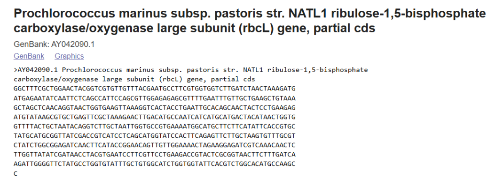
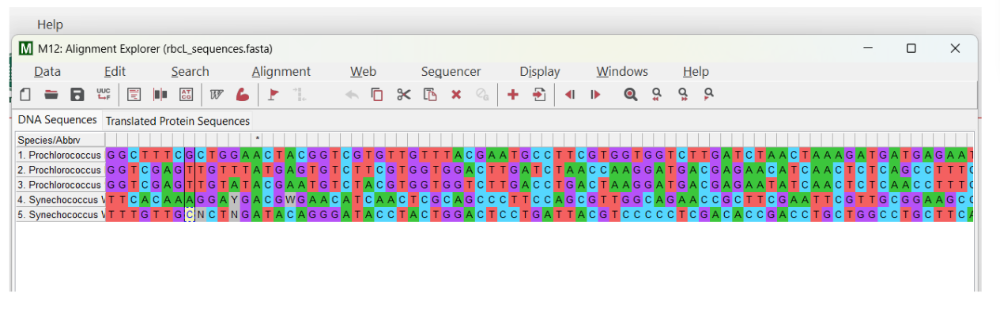
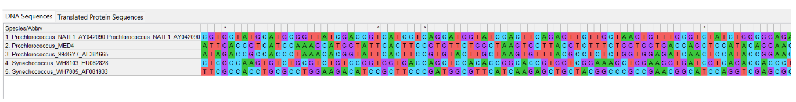
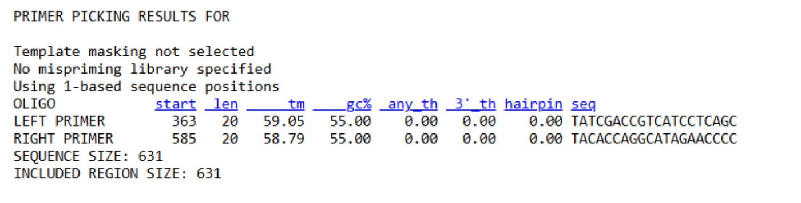
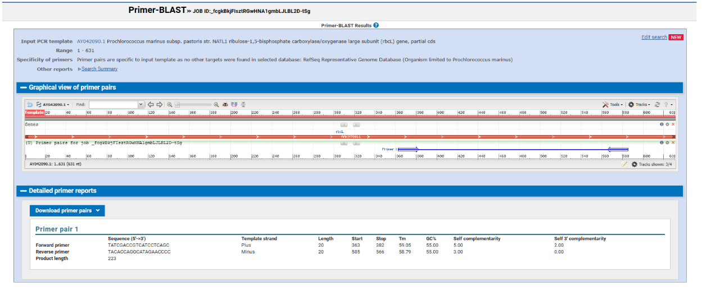
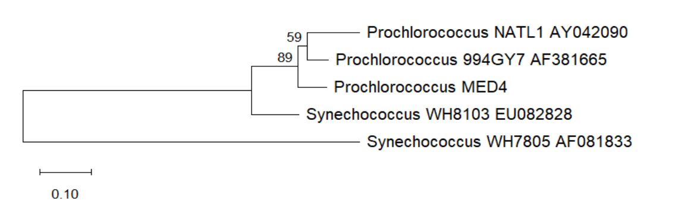

# Primer Design and Phylogenetic Analysis of *Prochlorococcus marinus* Using the rbcL Gene

## Introduction

### Target Organism

The target organism selected for this study was *Prochlorococcus marinus*, a marine photosynthetic cyanobacterium that is among the most abundant photosynthetic microorganisms in the world's oceans. *Prochlorococcus* plays a major role in marine primary production and contributes significantly to global carbon cycling.

### Gene / Barcode Region

The molecular marker used in this study was the **rbcL** gene (*ribulose-1,5-bisphosphate carboxylase/oxygenase large subunit*). This gene encodes the large subunit of RuBisCO, the key enzyme responsible for carbon fixation during photosynthesis.

### Why rbcL is Useful for Species Identification

The **rbcL** gene is widely used as a molecular marker for photosynthetic organisms because it contains both conserved and variable regions. Conserved regions facilitate reliable primer design and sequence alignment, while variable regions provide sufficient genetic variation for distinguishing closely related species and inferring evolutionary relationships. As a result, **rbcL** is commonly used in molecular identification and phylogenetic studies of cyanobacteria, algae, and plants.

### Study Objective

The objective of this study was to design PCR primers targeting the **rbcL** gene of *Prochlorococcus marinus* and to evaluate their specificity using NCBI Primer-BLAST. In addition, phylogenetic analysis was performed to investigate the evolutionary relationships between *Prochlorococcus marinus* and related cyanobacterial species using **rbcL** gene sequences.
## Sequence Collection and Alignment

DNA sequences of the **rbcL** gene were collected from the NCBI Nucleotide database. The reference sequence used for primer design was obtained from *Prochlorococcus marinus* subsp. *pastoris* strain NATL1 (Accession Number: AY042090.1). Additional **rbcL** sequences from related *Prochlorococcus* and *Synechococcus* strains were retrieved for phylogenetic analysis. All sequences were downloaded in FASTA format and combined into a single dataset for alignment and tree construction.





*Figure 1. NCBI record of the Prochlorococcus marinus NATL1 rbcL gene sequence (AY042090.1) used in this study.*
### Selected Sequences

The following rbcL sequences were selected for primer design, sequence alignment, and phylogenetic analysis.

| Organism | Accession Number | Sequence ID |
|-----------|-----------|-----------|
| *Prochlorococcus marinus* NATL1 | AY042090.1 | Prochlorococcus_NATL1_AY042090 |
| *Prochlorococcus marinus* MED4 | Retrieved from NCBI | Prochlorococcus_MED4 |
| *Uncultured Prochlorococcus* sp. clone 994GY7 | AF381665.1 | Prochlorococcus_994GY7_AF381665 |
| *Synechococcus* sp. WH8103 | EU082828.1 | Synechococcus_WH8103_EU082828 |
| *Synechococcus* WH7805 | AF081833.1 | Synechococcus_WH7805_AF081833 |

The complete FASTA sequences used in this study are provided below.

<details>
<summary><strong>Click to view FASTA sequences</strong></summary>

```fasta
>Prochlorococcus_NATL1_AY042090 GGCTTTCGCTGGAACTACGGTCGTGTTGTTTACGAATGCCTTCGTGGTGGTCTTGATCTAACTAAAGATGATGAGAATATCAATTCTCAGCCATTCCAGCGTTGGAGAGAGCGTTTTGAATTTGTTGCTGAAGCTGTAAAGCTAGCTCAACAGGTAACTGGTGAAGTTAAAGGTCACTACCTGAATTGCACAGCAACTACTCCTGAAGAGATGTATAAGCGTGCTGAGTTCGCTAAAGAACTTGACATGCCAATCATCATGCATGACTACATAACTGGTGGTTTTACTGCTAATACAGGTCTTGCTAATTGGTGCCGTGAAAATGGCATGCTTCTTCATATTCACCGTGCTATGCATGCGGTTATCGACCGTCATCCTCAGCATGGTATCCACTTCAGAGTTCTTGCTAAGTGTTTGCGTCTATCTGGCGGAGATCAACTTCATACCGGAACAGTTGTTGGAAAACTAGAAGGAGATCGTCAAACAACTCTTGGTTATATCGATAACCTACGTGAATCCTTCGTTCCTGAAGACCGTACTCGCGGTAACTTCTTTGATCAAGATTGGGGTTCTATGCCTGGTGTATTTGCTGTGGCATCTGGTGGTATTCACGTCTGGCACATGCCAAGCC 


>Prochlorococcus_MED4 GGTCGAGTTGTTTATGAGTGTCTTCGTGGTGGACTTGATCTAACCAAGGATGACGAGAACATCAACTCTCAGCCTTTCCAACGCTGGAGAGAGCGTTTTGAGTTTGTTGCAGAAGCGGTGAAGCTTGCTCAGCAGGAAACTGGTGAGGTTAAGGGCCATTACCTCAATTGCACAGCAACAACACCCGAAGAGATGTATGAGCGCGCCGAGTTCGCTAAAGAACTTGACATGCCGATCATCATGCATGACTACATCACAGGTGGCTTTACGGCTAATACTGGCTTGGCTAACTGGTGCCGTAAGAACGGAATGTTGTTACATATTCACCGTGCAATGCATGCGGTAATTGACCGTCATCCAAAGCATGGTATTCACTTCCGTGTTCTGGCTAAGTGCTTACGTCTTTCTGGTGGTGACCAGCTCCATACAGGAACTGTGGTTGGAAAGCTAGAAGGTGATCGTCAGACCACACTTGGTTATATTGACAACCTTCGTGAATCCTTTGTTCCAGAAGACCGCACACGCGGAAACTTCTTTGATCAGGATTGGGGTTCAATGCCTGGTGTGTTCGCTGTTGCCTCTGGTGGT 


>Prochlorococcus_994GY7_AF381665 GGTCGAGTTGTATACGAATGTCTACGTGGTGGTCTTGACCTGACTAAGGATGACGAGAATATCAACTCTCAACCTTTCCAACGTTGGAGAGAACGTTTCGAGTTTGTTGCTGAAGCTGTAAAGCTTGCTCAACAGGAAACTGGTGAGGTTAAAGGTCATTATCTCAATTGCACAGCGACTACTCCTGAGGACATGTATGAGCGTGCTGAGTTCGCTAAAGAACTTGACATGCCAATCATCATGCATGACTACATCACCGGTGGATTTACGGCAAACACAGGCTTAGCCAATTGGTGCCGTAAGAATGGCATGTTGCTTCATATTCACCGTGCTATGCATGCGGTTATAGACCGCCACCCTAAACACGGTATTCACTTCCGTGTACTTGCTAAGTGTTTACGCCTCTCTGGTGGAGATCAACTCCATACCGGAACTGTTGTTGGAAAGCTTGAAGGTGATCGTCAGACCACCCTTGGTTTTATTGACAACCTTCGTGAGTCCTTTGTCCCTGAAGACCGCTCACGCGGTAACTTCTTCGATCAGGATTGGGGTTCCATGCCTGGTGTGTTCGCTGTTGCATCTGGTGGT 


>Synechococcus_WH8103_EU082828 TTCACAAAGGAYGACGWGAACATCAACTCGCAGCCCTTCCAGCGTTGGCAGAACCGCTTCGAATTCGTTGCGGAAGCCATCAAGCTGTCCGAGCAGGAGACCGGCGAGCGCAAGGGTCACTACCTCAACGTGACCGCCAACACTCCCGAGGAGATGTATGAGCGCGCTGAGTTCGCCAAGGAACTCGGCATGCCGATCATCATGCACGACTTCATCACCGGTGGCTTCACGGCCAACACCGGTCTGTCGAAGTGGTGCCGTAAGAACGGCATGTTGCTGCACATCCACCGCGCCATGCACGCGGTGATCGACCGTCATCCCAAGCACGGCATCCACTTCCGCGTTCTCGCCAAGTGTCTGCGTCTGTCCGGTGGTGACCAGCTCCACACCGGCACCGTGGTCGGAAAGCTGGAAGGTGATCGTCAGACCACCCTCGGCTACATCGACCAGCTGCGCGAATCCTTCGTGCCCGAAGACCGCAGCCGCGGCAACTTCTTCGATCAGGACTGGGGTTCCATGCCTGGCGTGTTCGCCGTTGCTTCCGGCGGTATYCACGTHTGGCAYATGCC 


>Synechococcus_WH7805_AF081833 TTTGTTGCNCTNGATACAGGGATACCTACTGGACTCCTGATTACGTCCCCCTCGACACCGACCTGCTGGCCTGCTTCAAGTGCACCGGCCAAGACGGTGTGCCCAAGGAAGAAGTTGCCGCTGCTGTGGCTGCTGAATCCTCCACCGGCACCTGGTCCACTGTGTGGTCCGAGCTCCTCGCCGATCTCGACTTCTATAAAGGCCGTTGCTACCGCATCGAAGACGTCCCTGGTGACAAGGAGTCTTTCTATGCCTTCATCGCCTACCCCCTCGACCTGTTCGAAGAGGGTTCCATCACCAACGTTCTGACCTCCCTGGTCGGCAACGTGTTCGGTTTCAAGGCTCTTCGCCACCTGCGCCTGGAAGACATCCGCTTCCCGATGGCGTTCATCAAGAGCTGCTACGGCCCGCCGAACGGCATCCAGGTCGAGCGCGACCGGATGAACAAGTACGGACGTCCACTGCTGGGTTGCACCATCAAGCCGAAGCTCGGCCTGAGCGGTAAGAACTACGGCCGTGTTGTCTATGAGTGCCTGCGCGGTGGTCTGGACTTCACCAAAGACGACGAGAACATCAACTCCCAGCCCTTCCAGCGTTGGCAGAACCGCTTCGAATTCGTTGCGGAAGCCATCAAGCTGTCCGAGCAGGA 
```
</details>


## Multiple Sequence Alignment

The collected **rbcL** sequences were aligned using MEGA12. Multiple sequence alignment was performed with the ClustalW algorithm to identify conserved and variable regions prior to phylogenetic analysis.

**Software used:** MEGA12

**Alignment method:** ClustalW

**Sequence type:** DNA



*Figure 2. Multiple sequence alignment of rbcL DNA sequences performed using ClustalW in MEGA12.*

### Conserved Regions

Several highly conserved nucleotide positions were observed across all aligned sequences. Conserved regions are represented by columns containing identical nucleotides among the analyzed taxa. These regions are particularly useful for primer design because they provide stable binding sites for PCR amplification. The high level of conservation observed among the selected sequences reflects the essential biological function of the rbcL gene in photosynthetic carbon fixation.

### Variable Regions

Multiple variable nucleotide positions were observed throughout the alignment. These variations consisted primarily of single nucleotide polymorphisms (SNPs) that differentiated the *Prochlorococcus* sequences from the *Synechococcus* sequences. The three *Prochlorococcus* sequences showed relatively high sequence similarity, whereas greater divergence was observed between the two genera. Several ambiguous nucleotides (such as N, Y, W, and H) were present in some environmental sequences. No major insertions or deletions (indels) were detected within the aligned region.



*Figure 3. Multiple sequence alignment of rbcL sequences. Columns containing identical nucleotides across all taxa represent conserved regions, whereas columns containing different nucleotides (different colors) represent variable regions that contribute to genetic and phylogenetic differences among taxa.*
## Primer Design

Primers targeting the **rbcL** gene of *Prochlorococcus marinus* were designed using Primer3 and subsequently verified using NCBI Primer-BLAST. Primer design parameters were selected to obtain primers with suitable melting temperatures, GC content, and product size for PCR amplification.

### Selected Primer Pair

| Parameter | Forward Primer | Reverse Primer |
|------------|------------|------------|
| Sequence (5'→3') | TATCGACCGTCATCCTCAGC | TACACCAGGCATAGAACCCC |
| Length (bp) | 20 | 20 |
| Tm (°C) | 59.05 | 58.79 |
| GC Content (%) | 55.0 | 55.0 |
| Position in sequence | 363–382 | 585–566 |

### PCR Product

| Parameter | Value |
|------------|------------|
| Expected amplicon size | 223 bp |
| Target gene | rbcL |
| Organism | *Prochlorococcus marinus* NATL1 |
| Accession number | AY042090.1 |

### Primer Design Considerations

The selected primer pair was chosen because both primers have similar melting temperatures (approximately 59°C), balanced GC content (55%), and no significant self-complementarity or hairpin structures. These characteristics increase the likelihood of efficient and specific PCR amplification while minimizing the formation of secondary structures and non-specific PCR products.



*Figure 4. Primer3 output showing the selected forward and reverse primers designed for amplification of the rbcL gene of Prochlorococcus marinus NATL1. Primer characteristics including primer position, length, melting temperature (Tm), GC content, and expected amplicon size are shown.*
## Primer Verification and Phylogenetic Analysis

### Primer Verification Using NCBI Primer-BLAST

The primer pair designed using Primer3 was verified using NCBI Primer-BLAST. The analysis confirmed that the selected primers specifically target the **rbcL** gene of *Prochlorococcus marinus* NATL1 (GenBank accession AY042090.1). No significant off-target amplification was detected within the selected RefSeq representative genome database. The expected PCR product size was 223 bp.



*Figure 5. Primer-BLAST verification of the selected primer pair targeting the rbcL gene of Prochlorococcus marinus NATL1.*

### Phylogenetic Tree Construction

A phylogenetic tree was constructed using MEGA12 to investigate the evolutionary relationships among the selected *Prochlorococcus* and *Synechococcus* sequences.

### Phylogenetic Analysis Parameters

| Parameter | Setting |
|------------|------------|
| Software | MEGA12 |
| Sequence type | DNA |
| Alignment method | ClustalW |
| Tree-building method | Neighbor-Joining (NJ) |
| Substitution model | Kimura 2-parameter (K2P) |
| Bootstrap replicates | 1000 |
| Gaps/Missing data treatment | Pairwise deletion |



*Figure 6. Neighbor-Joining phylogenetic tree based on rbcL gene sequences constructed in MEGA12 using the Kimura 2-parameter model with 1000 bootstrap replicates.*
## Interpretation of the Phylogenetic Tree

The phylogenetic tree revealed two major groups corresponding to the genera *Prochlorococcus* and *Synechococcus*.

The three *Prochlorococcus* sequences (*P. marinus* NATL1, MED4, and clone 994GY7) clustered together, indicating a close evolutionary relationship among these strains based on the **rbcL** gene. Within this cluster, *Prochlorococcus marinus* NATL1 and clone 994GY7 were grouped most closely together.

This clustering pattern was expected because all three sequences belong to the genus *Prochlorococcus*. Accordingly, the target organism, *Prochlorococcus marinus* NATL1, grouped with closely related *Prochlorococcus* strains rather than with *Synechococcus* species.

Bootstrap analysis provided support for the major branches in the tree. The branch containing all *Prochlorococcus* sequences received a bootstrap value of **89%**, indicating strong support for this grouping. The branch joining NATL1 and 994GY7 received a bootstrap value of **59%**, indicating moderate support for this specific relationship.

The two *Synechococcus* sequences formed separate branches outside the *Prochlorococcus* cluster, reflecting greater genetic divergence between the two genera.

Overall, the phylogenetic analysis supports the expected evolutionary relationships among the selected cyanobacterial taxa and demonstrates that the **rbcL** gene is a useful molecular marker for phylogenetic and evolutionary studies.
